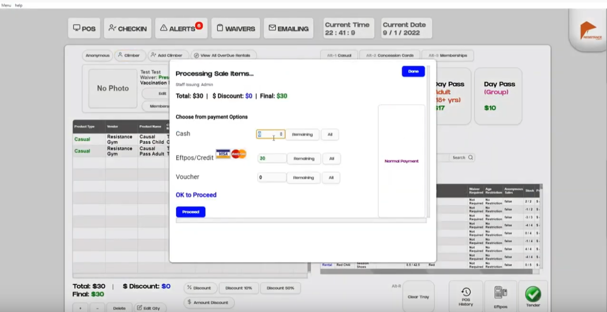
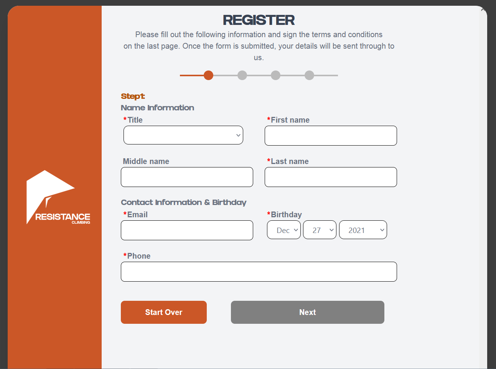

# OpenGym

  

Open Gym is free Point of Sales + Customer Relations Management software for climbing/fitness gym :)
Still needing a lot of work and branding is currently Resistance Climbing Gym, which is where it is 
first funded and developed. https://resistanceclimbing.co.nz/

## Installation
Coming Soon...

## Screenshots and Demo

[More Screen Shots](./ScreenShots.md)

[Video Demo](https://www.youtube.com/watch?v=DRsP95XWMsk)

[Online Waiver Station](https://resistance-waiver-station.netlify.app/)

## Functionalities 
- Product Creation/Stock Managment
- Product Rentals
- Member Creation/Management
- Membership Creation/Management
- Automatic Membership Invoicing Via Stripe
- Email System via MailGun + MailChimp
- Point of Sale + Eftpos Integration (Eftpos integration being tested right now)
- CheckIn System via RFID tag
- Security door integration with Paxton Access
- Alerts and Daily Check System
- Reporting (output CSV files)
- Remote Waiver Station

## TODO
- Redo Sales System
- Full Invoice Management System
- Different Admin User Logins
- Custom Branding etc
- Graphing and better reporting

## Integrates with

  

